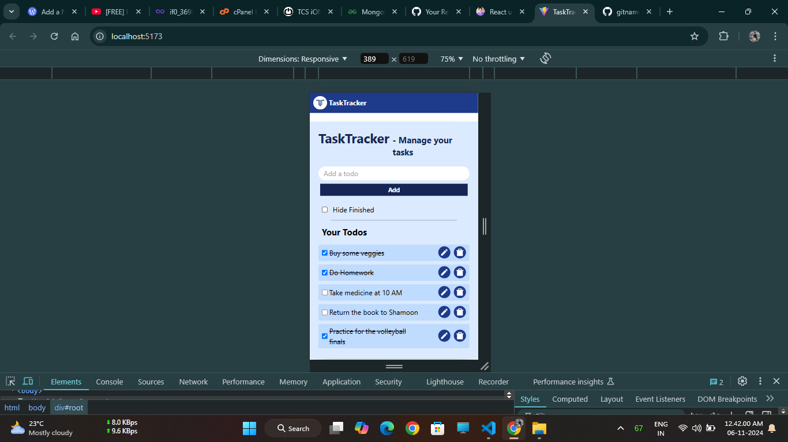
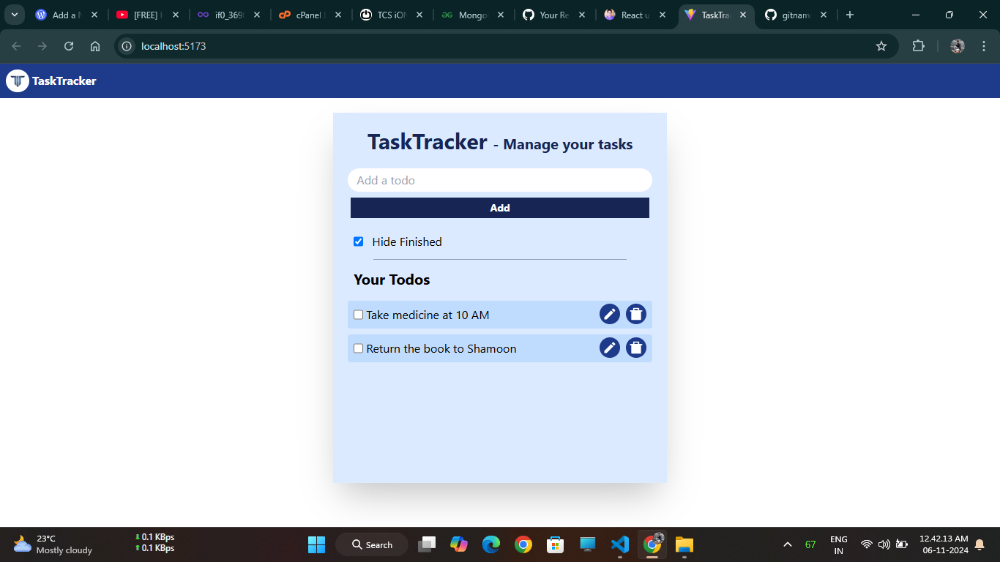

# TaskTracker

A responsive to-do list website built using **React.js** (with Vite) and **Tailwind CSS**. TaskTracker allows users to create, edit, and manage their tasks with a sleek and modern interface, saving to-dos locally so users can pick up right where they left off.

## Features

- **Add, edit, and delete tasks**
- **Responsive design** that adapts to various screen sizes
- **User-friendly interface** built with React and styled using Tailwind CSS
- **Local storage support** to save tasks even after closing the browser
- **Fast and efficient development** powered by Vite

## Demo

[Link to live demo](#) *(Replace with the actual link once deployed)*

## Screenshots





## Installation

1. **Clone the repository**
   ```
   git clone https://github.com/your-username/TaskTracker.git
   cd TaskTracker
    ```
2. **Install dependencies**
    ```
    npm install
    ```
3. **Run the development server**
    ```
    npm run dev
    ```
## Technologies Used
- **React.js** : JavaScript library for building user interfaces
- **Vite** : Fast development build tool
- **Tailwind CSS** : Utility-first CSS framework

## Contributing
Feel free to open issues or submit pull requests with improvements. Contributions are welcome!